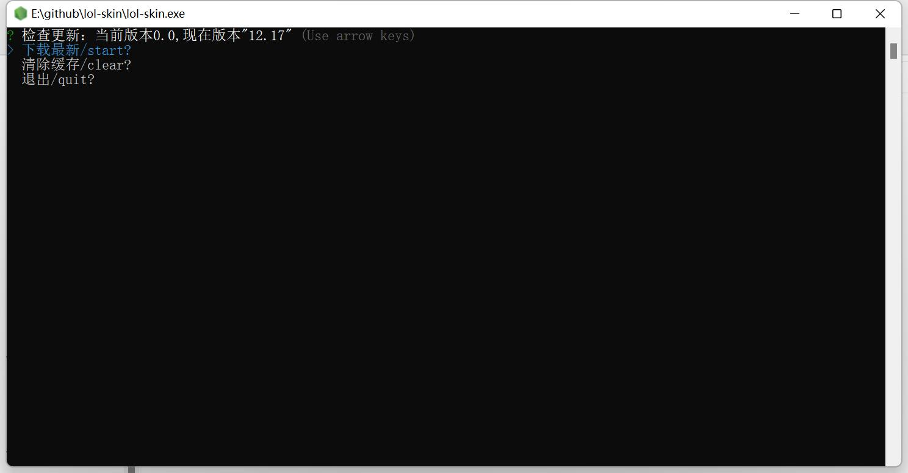

<h3 style="text-align: center"><a href="https://github.com/scripted-C20/lol-skin/blob/main/README.md">English</a> | <b>简体中文</b>  </h3>

# lol-skin

## 更新

### 1.6

修复清除缓存功能和闪退

### 1.5

舍弃了行读取，选择了更好的[Inquirer](https://github.com/SBoudrias/Inquirer.js)

添加了清除修改器的缓存功能

## 描述

 来自[skin](http://leagueskin.net/p/download-mod-skin-2020-chn) 的修改器

 自动检测最新的版本，并在未打开修改器时版本显示0.0 

 下载到当前目录

## 运行效果

